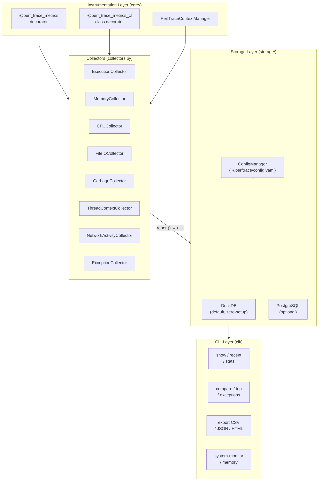
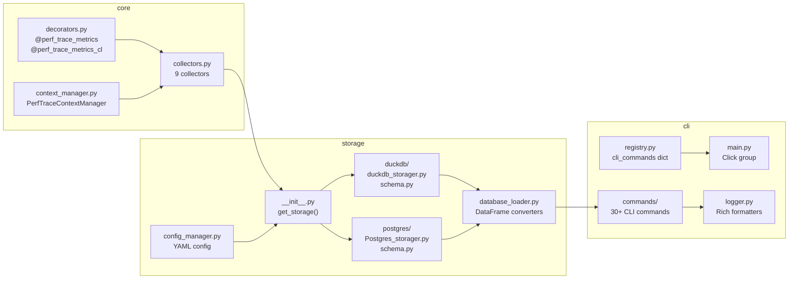
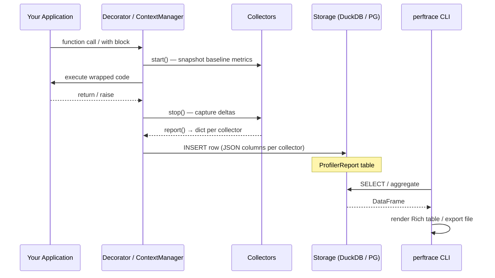

<div align="center">

```
 ██████╗ ███████╗██████╗ ███████╗████████╗██████╗  █████╗  ██████╗███████╗
 ██╔══██╗██╔════╝██╔══██╗██╔════╝╚══██╔══╝██╔══██╗██╔══██╗██╔════╝██╔════╝
 ██████╔╝█████╗  ██████╔╝█████╗     ██║   ██████╔╝███████║██║     █████╗
 ██╔═══╝ ██╔══╝  ██╔══██╗██╔══╝     ██║   ██╔══██╗██╔══██║██║     ██╔══╝
 ██║     ███████╗██║  ██║██║        ██║   ██║  ██║██║  ██║╚██████╗███████╗
 ╚═╝     ╚══════╝╚═╝  ╚═╝╚═╝        ╚═╝   ╚═╝  ╚═╝╚═╝  ╚═╝ ╚═════╝╚══════╝
```

### Production-grade Python performance tracing — zero infrastructure, one decorator

[](https://pypi.org/project/perftrace/)
[](https://pypi.org/project/perftrace/)
[](https://pypi.org/project/perftrace/)
[](https://pypi.org/project/perftrace/)
[](https://github.com/Maharavan/PerfTrace)

```bash
pip install perftrace
```

</div>

---

**PerfTrace** is a Python performance-tracing library and CLI tool that instruments functions, class methods, and arbitrary code blocks with a single decorator or context manager — no external agents, no cloud accounts, no configuration required.

It captures **execution time**, **memory allocation**, **CPU load**, **file I/O**, **network activity**, **thread context**, **garbage collection**, and **exception tracebacks** — all persisted in a local DuckDB database (or PostgreSQL) and surfaced through a rich, color-coded CLI.

```
╭──────────────────────── PerfTrace  ─────────────────────────╮
│   Decorator  →  Collectors  →  Storage  →  CLI Query/Export  │
╰──────────────────────────────────────────────────────────────╯
```

---

## Table of Contents

- [Architecture](#architecture)
- [Key Features](#key-features)
- [Installation](#installation)
- [Quick Start](#quick-start)
- [Instrumentation](#instrumentation)
- [Tracing Workflow](#tracing-workflow)
- [CLI Reference](#cli-reference)
  - [General](#general)
  - [Function commands](#function-commands)
  - [Context commands](#context-commands)
  - [Analysis commands](#analysis-commands)
  - [Time-based commands](#time-based-commands)
  - [System & Memory](#system--memory)
  - [Export commands](#export-commands)
- [Terminal Previews](#terminal-previews)
- [Configuration](#configuration)
- [Exception Tracking](#exception-tracking)
- [Database Schema](#database-schema)
- [Schema Migrations](#schema-migrations)
- [Examples](#examples)
- [Testing](#testing)
- [PerfTrace vs APM Tools](#perftrace-vs-apm-tools)
- [Contributing](#contributing)
- [License](#license)

---

## Architecture

PerfTrace is structured as three independent layers that compose together.



---

## Component Map



---

## Key Features

| Feature | Detail |
|---------|--------|
| **Zero-boilerplate instrumentation** | One decorator or `with` block — nothing else to configure |
| **Sub-µs execution timing** | Formatted automatically as `µs / ms / s` |
| **Memory tracking** | `tracemalloc` current + peak; displayed as `B / KB / MB / GB` |
| **CPU monitoring** | Per-call CPU % and RAM delta (MB) |
| **File I/O** | Read/write byte and op-count deltas via `psutil` |
| **Thread context** | Thread count and voluntary/involuntary context-switch deltas |
| **Network activity** | TCP/UDP connection and byte-transfer deltas |
| **Garbage collection** | GC count deltas per generation |
| **Exception tracking** | Type, message, and full traceback — always captured |
| **Statistical summaries** | min / max / avg / std-dev / p90 / p95 / p99 |
| **Side-by-side comparison** | Diff any two functions or context tags — avg exec, mem, CPU, RAM |
| **Multi-format export** | CSV · JSON · HTML (dark-themed, collapsible tracebacks) |
| **Live system monitor** | 2-column layout: per-core CPU + sparkline, RAM + Swap, network I/O |
| **Health diagnostics** | `doctor` checks config, DB, disk space, and Python version |
| **Pluggable storage** | DuckDB (default, zero-config) or PostgreSQL |

---

## Installation

```bash
pip install perftrace
```

**Requirements:** Python 3.11+

---

## Quick Start

```bash
# Verify your setup
perftrace doctor

# Colorized performance overview
perftrace summary

# Top memory consumers across all traced code
perftrace top-memory

# Hottest CPU functions (top 5)
perftrace top-cpu --limit 5

# All runs that raised exceptions
perftrace exceptions

# Head-to-head function comparison
perftrace compare-function load_data process_data

# Head-to-head context tag comparison
perftrace compare-context batch_job import_flow

# Per-function file I/O breakdown
perftrace io-report

# Live system monitor (3-second refresh)
perftrace system-monitor
```

> **Per-command help:** `perftrace <command> --help` shows arguments and options inline.

---

## Instrumentation

### Function decorator

```python
from perftrace import perf_trace_metrics

@perf_trace_metrics(profilers=["cpu", "memory", "file", "execution"])
def process_data(records):
    return [r * 2 for r in records]
```

Pass `profilers="all"` to activate every collector at once:

```python
@perf_trace_metrics(profilers="all")
def full_trace():
    ...
```

#### Available profilers

| Key | Collector | Metrics captured |
|-----|-----------|-----------------|
| `execution` | `ExecutionCollector` | wall-clock time *(always active)* |
| `cpu` | `CPUCollector` | CPU %, RAM delta (MB) |
| `memory` | `MemoryCollector` | tracemalloc current + peak |
| `file` | `FileIOCollector` | read/write bytes and op counts |
| `garbagecollector` | `GarbageCollector` | GC generation count deltas |
| `ThreadContext` | `ThreadContextCollector` | thread count + ctx-switch deltas |
| `network` | `NetworkActivityCollector` | TCP/UDP connections + byte transfer |

> `ExceptionCollector` and `ExecutionCollector` are **always active** — they run regardless of the `profilers` argument.

### Class decorator

```python
from perftrace import perf_trace_metrics_cl

@perf_trace_metrics_cl(profilers=["cpu", "memory"])
class Pipeline:
    def step_one(self, x):
        return x + 1

    @staticmethod
    def step_two(y):
        return y * 2
```

### Context manager

```python
from perftrace import PerfTraceContextManager

with PerfTraceContextManager(context_tag="etl-load", cls_collectors=["cpu", "memory", "file"]):
    data = load_large_dataset()
```

---

## Tracing Workflow



---

## CLI Reference

### General

| Command | Description |
|---------|-------------|
| `version` | Show installed PerfTrace version and runtime info |
| `help` | Grouped command reference (also: `--help` / `-h`) |
| `doctor` | Health-check config, DB, disk space, and Python version |
| `summary` | Color-coded performance overview with hotspot detection |
| `list` | List all profiled functions and context tags |

### Function commands

| Command | Args / Options | Description |
|---------|----------------|-------------|
| `show-function <name>` | — | All runs in one compact table |
| `recent-function <name>` | — | Deep per-metric breakdown of the latest run |
| `stats-function <name>` | — | Statistical summary (min/max/avg/p90/p95/p99) |
| `search-function <name>` | — | Historical run list |
| `count-function` | `--limit N` | Call frequency with distribution bars |
| `slowest` | — | Top-10 by cumulative execution time |
| `fastest` | — | Top-10 by cumulative execution time (ascending) |
| `compare-function <A> <B>` | — | Side-by-side avg metric comparison of two functions |

### Context commands

| Command | Args / Options | Description |
|---------|----------------|-------------|
| `show-context <tag>` | — | All runs for a context tag in one compact table |
| `recent-context <tag>` | — | Deep breakdown of the most recent run |
| `stats-context <tag>` | — | Statistical summary |
| `search-context <tag>` | — | Historical run list |
| `count-context` | `--limit N` | Call frequency with distribution bars |
| `compare-context <A> <B>` | — | Side-by-side avg metric comparison of two context tags |

### Analysis commands

| Command | Options | Description |
|---------|---------|-------------|
| `top-memory` | `--limit N` (default 10) | Top N functions/contexts by peak memory allocation |
| `top-cpu` | `--limit N` (default 10) | Top N functions/contexts by average CPU usage |
| `exceptions` | `--limit N` (default 50) | All trace records where an exception was raised |
| `compare-function <A> <B>` | — | Avg exec time, memory, CPU, RAM delta — side by side |
| `compare-context <A> <B>` | — | Same comparison for context manager tags |
| `io-report` | `--limit N` (default 20) | Aggregated file read/write bytes and op counts |

### Time-based commands

| Command | Description |
|---------|-------------|
| `today` | All calls executed today |
| `history` | Calls by date range |

### System & Memory

| Command | Options | Description |
|---------|---------|-------------|
| `system-status` | — | Current system snapshot with formatted sections |
| `system-info` | — | Static hardware / OS / Python environment details |
| `system-monitor` | `--interval N` | Live 2-column monitor — per-core CPU + sparkline, RAM + Swap, network I/O delta; default 3 s refresh |
| `memory` | — | Memory breakdown per function/context |

### Export commands

All exports print the **absolute file path**, **row count**, and **file size** on completion.

#### CSV

| Command | Options | Description |
|---------|---------|-------------|
| `export-csv` | `--filename` | All records |
| `export-function-csv` | `--filename` | Function records only |
| `export-context-csv` | `--filename` | Context records only |

#### JSON

| Command | Options | Description |
|---------|---------|-------------|
| `export-json` | `--filename  --limit` | All records |
| `export-function-json` | `--filename  --limit` | Function records only |
| `export-context-json` | `--filename  --limit` | Context records only |

#### HTML

| Command | Options | Description |
|---------|---------|-------------|
| `export-html` | `--filename` | All records — dark-themed responsive report |
| `export-function-html` | `--filename` | Function records |
| `export-context-html` | `--filename` | Context records |

HTML reports include:
- Dark-themed responsive table
- JSON metric cells expanded inline (`key: value`)
- Exception column colour-coded — red with collapsible traceback / green for clean runs
- Generated timestamp and row count in the header

---

## Terminal Previews

### `compare-function` — side-by-side avg metric diff

```
$ perftrace compare-function load_data process_data

╭─── PerfTrace  Function Comparison ───╮

           Function Comparison — Average Metrics
┌──────────────────────┬──────────────┬────────────────┬───────────┐
│ Metric               │ load_data    │ process_data   │ Δ (A − B) │
│                      │ (8 runs)     │ (8 runs)       │           │
├──────────────────────┼──────────────┼────────────────┼───────────┤
│ Avg Exec Time        │  12.450 ms   │   3.210 ms     │ +9.240 ms │
│ Avg Peak Mem         │  2.34 MB     │  512.00 KB     │ +1.84 MB  │
│ Avg CPU %            │  14.2%       │   8.7%         │     —     │
│ Avg RAM Δ            │ +0.120 MB    │  +0.031 MB     │     —     │
└──────────────────────┴──────────────┴────────────────┴───────────┘
```

`compare-context batch_job import_flow` produces the same layout with context tag names as headers.

### `show-function` — all historical runs in one compact table

```
$ perftrace show-function my_function

                    my_function  (12 records)
┌───┬─────────────────────┬───────────┬──────────┬────────┬───────┬──────────┬────────────┐
│ # │ Timestamp           │ Exec Time │ Peak Mem │  RAM Δ │  CPU% │ Threads Δ│ Status     │
├───┼─────────────────────┼───────────┼──────────┼────────┼───────┼──────────┼────────────┤
│ 1 │ 2024-06-22 10:00:00 │  1.234 ms │ 45.32 KB │+0.001 MB│  2.1%│    0     │ ✓ OK       │
│ 2 │ 2024-06-22 10:01:05 │  2.891 ms │ 48.10 KB │+0.002 MB│  1.8%│    0     │ ✓ OK       │
│ 3 │ 2024-06-22 10:02:11 │  0.891 ms │ 45.00 KB │+0.000 MB│  1.5%│    0     │⚠ ValueError│
└───┴─────────────────────┴───────────┴──────────┴────────┴───────┴──────────┴────────────┘
```

### `top-memory` — ranked by peak allocation

```
$ perftrace top-memory --limit 5

         Top 5 — Peak Memory Usage
┌───┬───────────────┬──────────┬─────────────┬──────────┐
│ # │ Name          │ Type     │ Current Mem │ Peak Mem │
├───┼───────────────┼──────────┼─────────────┼──────────┤
│ 1 │ load_data     │ function │  2.10 MB    │  2.34 MB │
│ 2 │ etl-load      │ context  │  1.80 MB    │  1.95 MB │
│ 3 │ process_data  │ function │ 498.10 KB   │ 512.00 KB│
└───┴───────────────┴──────────┴─────────────┴──────────┘
```

### `exceptions` — failed traces at a glance

```
$ perftrace exceptions

                 Exception Traces (2 records)
┌─────────────────────┬──────────────┬──────────┬───────────┬───────────────┬──────────────────────┐
│ Timestamp           │ Name         │ Type     │ Exec Time │ Exception Type│ Message              │
├─────────────────────┼──────────────┼──────────┼───────────┼───────────────┼──────────────────────┤
│ 2024-06-22 10:02:11 │ process_data │ function │  0.891 ms │ ValueError    │ invalid literal ...  │
│ 2024-06-22 14:15:33 │ etl-load     │ context  │  3.212 ms │ KeyError      │ 'user_id'            │
└─────────────────────┴──────────────┴──────────┴───────────┴───────────────┴──────────────────────┘
```

### `system-monitor` — live 2-column grid

```
╭──────────────────── Live System Monitor ─────────────────────╮
│  Left column              │  Right column                    │
│  ─────────────────────    │  ──────────────────────────────  │
│  CPU (per-core bars       │  Disk  Used / Free / %           │
│  + sparkline trend)       │  Network  ↑ sent/s  ↓ recv/s     │
│  Memory  RAM + Swap       │  System  Uptime · Processes       │
╰───────────────────────────────────────────────────────────────╯
```

Colours: **green** ≤ 50 % · **yellow** 50–80 % · **red** > 80 %  
Sparkline characters: `▁▂▃▄▅▆▇█` (last 20 readings)

---

## Configuration

Config file locations:

| OS | Path |
|----|------|
| Linux / macOS | `~/.perftrace/config.yaml` |
| Windows | `%USERPROFILE%\.perftrace\config.yaml` |

### DuckDB (default — zero setup)

```yaml
database:
  engine: duckdb
  duckdb:
    path: ./data/perftrace.duckdb
```

### PostgreSQL

```yaml
database:
  engine: postgresql
  postgresql:
    host: localhost
    port: 5432
    user: postgres
    password: your_password
```

Interactive wizard:

```bash
perftrace set-config
perftrace doctor        # verify connection
```

---

## Exception Tracking

Every instrumented call records an `exception_collector` entry automatically — no opt-in required.

| Field | Description |
|-------|-------------|
| `occurred` | `true` if an exception was raised |
| `exception_type` | Exception class name, e.g. `ValueError` |
| `exception_message` | The string message |
| `traceback` | Full formatted traceback |

- `show-function` and `show-context` highlight failed runs with `⚠ ExcType` in red.
- `exceptions` lists every failed trace across all functions and contexts.
- HTML exports include collapsible `<details>` blocks, colour-coded red for failures.

---

## Database Schema

Table: **`ProfilerReport`**

| Column | Type | Source |
|--------|------|--------|
| `timestamp` | TIMESTAMP | `datetime.datetime.now()` |
| `function_name` | VARCHAR | decorator: `func.__name__`; context: `NULL` |
| `context_tag` | VARCHAR | decorator: `NULL`; context: user-supplied tag |
| `execution_collector` | JSON | `ExecutionCollector.report()` |
| `memory_collector` | JSON | `MemoryCollector.report()` |
| `cpu_collector` | JSON | `CPUCollector.report()` |
| `file_io_collector` | JSON | `FileIOCollector.report()` |
| `garbage_collector` | JSON | `GarbageCollector.report()` |
| `thread_context_collector` | JSON | `ThreadContextCollector.report()` |
| `network_activity_collector` | JSON | `NetworkActivityCollector.report()` |
| `exception_collector` | JSON | `ExceptionCollector.report()` |

---

## Schema Migrations

When upgrading PerfTrace, new columns are added automatically via `ALTER TABLE … ADD COLUMN IF NOT EXISTS`. Existing rows get `NULL` for new columns — no manual migration needed.

```python
# duckdb/schema.py
DUCKDB_MIGRATION = f"""
ALTER TABLE {DB_TABLE_NAME} ADD COLUMN IF NOT EXISTS new_col JSON;
"""
```

The storager runs this after `CREATE TABLE IF NOT EXISTS` and silently ignores "column already exists" errors.

---

## Examples

The `example/` directory contains a ready-to-run sample that exercises every collector type.

### `example/test_data.py`

```python
from perftrace import perf_trace_metrics, perf_trace_metrics_cl, PerfTraceContextManager

# Class decorator — instruments every method
@perf_trace_metrics_cl(profilers=["cpu", "memory"])
class MyProcessor:
    def step1(self, x): return x + 1
    def step2(self, y): return y * 2

# Function decorator — all profilers
@perf_trace_metrics(profilers="all")
def list_comprehensive():
    return [i for i in range(100_000)]

# File I/O collector
@perf_trace_metrics(profilers=["cpu", "file"])
def normal_loop():
    with open("sample_io.txt", "w") as f:
        f.write("hello\n" * 100)

# Read the file — captured by the "file" collector
@perf_trace_metrics(profilers=["cpu", "memory", "file"])
def read_sample_file():
    with open("sample_io.txt") as f:
        return f.readlines()

# Context manager — include "file" to capture I/O inside the block
with PerfTraceContextManager(
    context_tag="work", cls_collectors=["cpu", "memory", "file"]
) as ctx:
    with open("sample_io.txt", "a") as f:
        f.write("appended\n")
```

Run it, then explore the data:

```bash
python example/test_data.py

perftrace summary
perftrace io-report
perftrace show-function normal_loop
perftrace compare-function normal_loop list_comprehensive
perftrace show-context work
```

> **File I/O tip:** The profiler key for `FileIOCollector` is `"file"` — not `"file_io"`.  
> Always include `"file"` in `profilers` for any function that reads or writes files.

---

## Testing

PerfTrace ships a pytest suite under `tests/`. Run the full suite with:

```bash
pip install pytest
pytest tests/
```

### Test files

| File | Module(s) covered | Tests |
|------|-------------------|-------|
| `test_system_monitor.py` | `system_monitor` | 42 |
| `test_io_report.py` | `io_report` | 25 |
| `test_compare_data.py` | `compare_data` (function + context) | 31 |
| `test_top_commands.py` | `top_commands` (top_memory + top_cpu) | 28 |
| `test_exceptions_cmd.py` | `exceptions` | 20 |
| `test_show_data.py` | `show_data` (show_function + show_context) | 19 |
| `test_recent_data.py` | `recent_data` (recent_function + recent_context) | 22 |
| `test_stats.py` | `stats` (stats_function + stats_context) | 20 |
| `test_frequency_count.py` | `frequency_count` (count_function + count_context) | 36 |
| `test_summary.py` | `summary` | 28 |
| `test_version_fastest_slowest.py` | `version`, `fastest_execution`, `slowest_execution` | 32 |

**Total: 303 tests · 0 failures**

### Test strategy

- Each test file patches `check_retrieve_data` with an in-memory pandas DataFrame — no real database required.
- Rich `Console` output is captured by patching the module-level `console` object with a `Console(file=StringIO())` instance, enabling full output assertions.
- Table builders in `system_monitor` are tested with `@patch` on all `psutil` calls so tests are deterministic and fast.
- Helper functions (`_fmt_bytes`, `_pct_color`, `_progress_bar`, `_sparkline`, `_bar`, `_avg_metrics`) are unit-tested directly, independently of the CLI layer.

---

## PerfTrace vs APM Tools

| | PerfTrace | APM (Datadog, New Relic…) |
|--|-----------|--------------------------|
| **Setup** | `pip install` | Agent + cloud account |
| **Granularity** | Function / block level | Service / request level |
| **Storage** | Local DuckDB or PostgreSQL | Cloud |
| **Exception capture** | Automatic | Yes |
| **Export** | CSV / JSON / HTML | Dashboards / API |
| **Always-on sampling** | No — on demand | Yes |
| **Cost** | Free, open-source | Subscription |

PerfTrace is **developer-local, on-demand, and free** — purpose-built for CI profiling, performance regression testing, and targeted optimization work where cloud APM is too heavyweight.

---

## Contributing

Contributions are welcome. The repo includes inline documentation covering the architecture, collector contracts, schema migration pattern, value-formatting helpers, and the checklist to follow when adding commands, collectors, or export formats.

---

## License

[MIT License](LICENSE)
